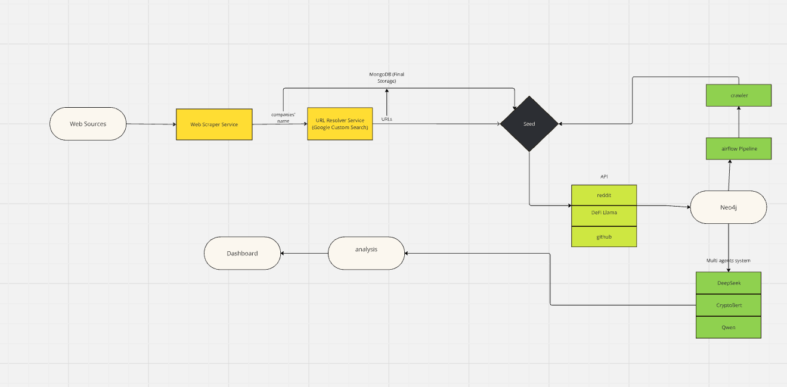

# Web3 Sustainability Assessment Platform (W3SAP)

Welcome to the **Web3 Sustainability Assessment Platform (W3SAP)** repository! This project is being developed as part of a hackathon to create an AI-driven tool for evaluating and monitoring the sustainability of Ethereum-based projects. W3SAP automates the assessment of sustainability claims by leveraging multiple data sources, APIs, and advanced data processing techniques.

## Project Overview

**W3SAP** assesses sustainability metrics for Ethereum-based Web3 projects, providing a platform that verifies claims related to energy consumption, carbon offsets, governance, transparency, and overall sustainability. The platform integrates data sources, APIs, and AI-powered analytics to evaluate and score project sustainability.

## Front End

Access the front end of the platform [here](https://kzmq8ohpl6rir027e06d.lite.vusercontent.net/?fbclid=IwY2xjawIdWzFleHRuA2FlbQIxMAABHeip66ZXyLthQhwQE_U5aYzhIy_ENhQY74syLP3Ju8F0kz3ACCxTP4Xcqw_aem_Mr3eDIOMc2exjKU_rAFvbQ).

## Pipeline Overview

Our data pipeline consists of the following key components:

### 1. **Data Collection**
- **Web Source Service**: Integration with public APIs (e.g., GitHub, DefiLama, Reddit) and custom web scraping tools for comprehensive data collection.
- **URL Resource Services**: Usage of Google Search API and custom tools to discover and gather data.

### 2. **Data Processing and Analysis**
- **Airflow**: Orchestrates workflows for efficient data collection and processing.
- **Neo4j Integration**: A multi-agent system uses Neo4j to connect and aggregate data for accurate sustainability metrics.

### 3. **Agent Negotiation and Ensemble Decision-Making**
- **Cross-Agent Negotiation**: Agents produce outputs (e.g., sustainability scores) and engage in a voting or consensus step.
  1. **Collect Scores & Rationales**: Each agent submits a score and rationale based on Neo4j subgraph evidence.
  2. **Cross-Verification**: Agents compare conclusions, focusing on discrepancies.
  3. **Negotiation Round**: A weighted voting mechanism prioritizes agents with relevant expertise.
  4. **Final Aggregation**: A unified ensemble score and combined rationale are produced.

### 4. **User Feedback and Visualization**
- Results are available through an intuitive interface, providing comprehensive sustainability scores for each project.

## Future Work

- **Enhanced Data Integration**: Integrate additional data sources for broader assessments.
- **Advanced Analysis Tools**: Develop more sophisticated AI techniques for improved decision-making.
- **User Interface Development**: Build a user-friendly interface for real-time interaction and visualization.

## Team

- **Hackathon Team**: A group of passionate developers and data scientists working on W3SAP.

## License

This project is licensed under the MIT License. See the [LICENSE](LICENSE) file for details.
